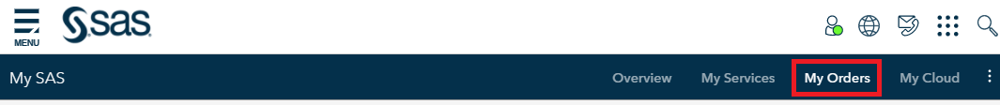
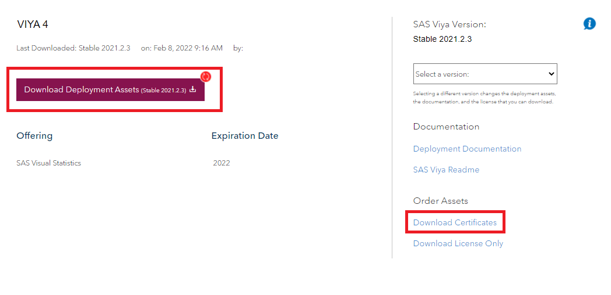
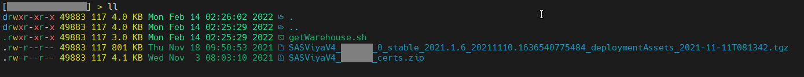
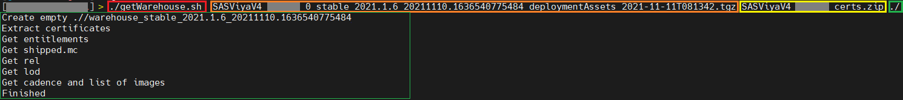
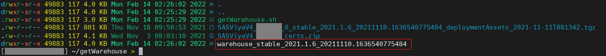
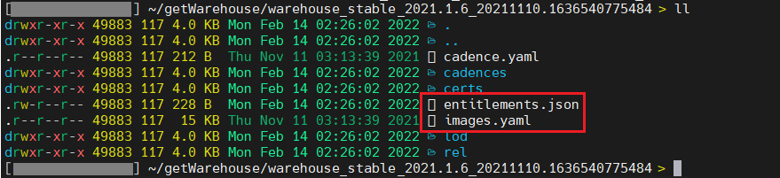

# SAS&reg; Viya Warehouse

## Overview

This project provides an alternate way to download the contents of a SAS&reg; Viya&reg; software order without using SAS Mirror Manager. The tools in this project create a software repository warehouse, which contains all the information that the SAS Viya Deployment Operator requires during the SAS Viya deployment process. 

A list of container images and permissions is also extracted, based on the contents of a SAS Viya software order. With this information, a third-party tool can be used to provide the container images to an internal registry.

**IMPORTANT:** You must use the same files for the download of the repository warehouse contents to perform the SAS Viya deployment. 

### Requirements

The getWarehouse script that is provided in this project requires two input files, which can be downloaded from the `my.sas.com` portal. To access the files, you need a valid SAS license, a registration on [my.sas.com](https://my.sas.com/), and the required permissions to download your software orders. 

When you order SAS software, SAS sends a Software Order Email (SOE) to your business or organization. Your SOE includes information about the software order, including a link to `my.sas.com`.


## Getting Started

1. Log in to `my.sas.com`. Click the **My Orders** tab.

   

   Your orders are displayed in a list that resembles the one shown below. 
   
1. From the list of orders, download the following required files: 

      - The SAS Deployment Assets 
      - The SAS Certificates

      

1. Clone the Git project. Run the following command: 

   ```bash
   cd ~
   git clone https://github.com/sassoftware/viya4-warehouse.git
   ```

1. Change directories and make sure that the getWarehouse.sh script has execute rights:

   ```bash
   cd ~/viya4-warehouse
   chmod +x getWarehouse.sh
   ```

1. Copy your SAS Deployment Assets ZIP file and the SAS certificates ZIP file into the same directory as the getWarehouse.sh script. 

   

### Running

In order to download the repository warehouse data, execute the getWarehouse.sh script with these three parameters in this exact order:

1. the filename of the SAS Deployment Assets ZIP file
2. the filename of the SAS Certificates ZIP file
3. the output destination (a directory path)

### Examples

Below is an example API call that shows the three parameters that the getWarehouse.sh script requires.

```bash
# Copy SAS Deployments Assets & Certificates into the current dir
./getWarehouse.sh \
  SASViya4_ABCDEF_0_stable_2021.1.6_20211110.1636540775484_deploymentAssests_2021-11-11T081342.tgz \
  SASViya4_ABCDEF_certs.zip \
  ./
```

If the script ends successfully, the output should resemble the following: 



A new directory that contains the SAS Viya repository warehouse data has been created:



As an addition to the SAS repository warehouse data, a `result` directory contains a list of the SAS container images and the entitlement information that is required in order to download these images.



### Troubleshooting

If the download does not succeed, verify that the client certificate has not been removed by a web washer.

## Contributing

We welcome your contributions! Please read [CONTRIBUTING.md](CONTRIBUTING.md) for details on how to submit contributions to this project. 

## License

This project is licensed under the [Apache 2.0 License](LICENSE).

## Additional Resources

* https://support.sas.com//en/software/sas-viya.html
* https://support.sas.com/en/documentation/install-center/viya/deployment-tools/4/mirror-manager.html
