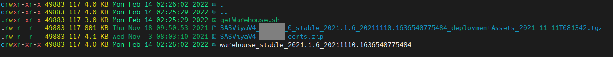
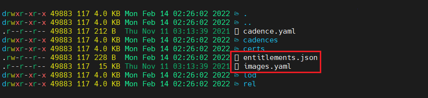

# SAS Viya Warehouse

## Overview

The aim of this project is to provide an alternative way to download the SAS Viya Warehouse without having to use the SAS MirrorMgr. The SAS Warehouse contains all the information that the SAS Deployment Operator needs during the deployment. A list of container images and permissions is also extracted. With this information, a third-party tool can be used to provide the container images to an internal registry.

**Attention:** Please note to use the same files for the download of the Warehouse and the SAS deployment. 

### Prerequisites

The getWarehouse script needs two input files which can be downloaded from the **my.sas.com** portal. To access the files you need a valid SAS license, a registration on my.sas.com and the permissions to download your orders. 


After you select "My Orders" your orders will shown in the list  below. Here you can download the needed files. 

1. The SAS Deployment Assets 
2. The SAS Certificates


### Installation

Clone the Git-Project, e.g.: 

```bash
cd ~
git clone https://github.com/sassoftware/getwarehouse.git
```

Change the directory and make sure that the getWarehouse.sh script has execute rights:

```bash
cd ~/getWarehouse
chmod +x getWarehouse.sh
```


## Getting Started

To start copy your SAS Deployment Assets and the SAS Certificates into the same directory of the getWarehouse.sh script. 


### Running

For downloading the SAS warehouse data, execute the getWarehouse.sh script with these three parameters in the exact order:

1. the SAS Deployment Assets file
2. the SAS Certificates file
3. the output destination (directory)

### Examples

Below is an example call. Please note the three parameters behind the getWarehouse.sh script.

```bash
# Copy SAS Deployments Assets & Certificates into the current dir
./getWarehouse.sh \
  SASViya4_ABCDEF_0_stable_2021.1.6_20211110.1636540775484_deploymentAssests_2021-11-11T081342.tgz \
  SASViya4_ABCDEF_certs.zip \
  ./
```

If the script ends successfully the output should look like this. 


Now you will find a new directory which container the SAS warehouse data.



As an addition to the SAS warehouse data the result directory contains a list of the SAS container images and the entitlement information to download them.



### Troubleshooting

If the download doesn't work please be sure the the client certificate isn't removed by any web washer.

## Contributing

We welcome your contributions! Please read [CONTRIBUTING.md](CONTRIBUTING.md) for details on how to submit contributions to this project. 

## License

This project is licensed under the [Apache 2.0 License](LICENSE).

## Additional Resources

* https://support.sas.com//en/software/sas-viya.html
* https://support.sas.com/en/documentation/install-center/viya/deployment-tools/4/mirror-manager.html
